# NeuralFlix 🎬
> The Premium Hybrid ML Recommendation & Cinematic Discovery Platform for Global Cinema.

[](https://fastapi.tiangolo.com/)
[](https://nextjs.org/)
[](https://tailwindcss.com/)
[](https://qdrant.tech/)
[](https://redis.io/)
[](https://www.postgresql.org/)
[](https://www.mongodb.com/)
[](https://www.docker.com/)

---

## 📽️ Project Vision & Philosophy

**NeuralFlix** is a premium, state-of-the-art cinematic discovery engine designed to bridge the gap between regional global cinema and mainstream Hollywood blockbusters. It is engineered with a **"Liquid Glass" design language**, sporting immersive Aurora mesh gradients, dynamic WebGL 3D layers, interactive maps, and responsive user onboarding.

### Balanced Global Cinema Ingestion Ratio
At its core, NeuralFlix combats the geographic bias typical of modern recommendation engines. The ingestion pipeline actively balances regional cinema, enforcing a strict **1:2 ratio** between Indian Cinema (Bollywood, Tollywood, Kollywood) and Hollywood/International Cinema (Korean, French, Japanese, Spanish, Brazilian, Iranian).

---

## 🏗️ High-Level Platform Architecture

```mermaid
graph TD
    User([User Client]) -->|HTTPS / WSS| Nginx[Nginx Reverse Proxy]
    
    subgraph "Frontend Layer (Next.js 15)"
        Nginx -->|Route Request| WebApp[Next.js App Router]
        WebApp --> ThreeJS[Three.js WebGL Viewport]
        WebApp --> WorldMap[Cinema World Map]
        WebApp --> TasteDNA[Taste DNA Dashboard]
        WebApp --> CmdPalette[Command Palette]
    end

    subgraph "Backend API (FastAPI Microservices)"
        Nginx -->|REST / WebSockets| FastAPI[FastAPI Gateway]
        FastAPI --> JWTAuth[JWT Auth Service]
        FastAPI --> WebSockets[WebSocket Real-time Feed]
        FastAPI --> RateLimit[Slowapi Rate Limiter]
        FastAPI --> Observability[Structlog Monitor]
    end

    subgraph "Personalization & Recommendation Engine"
        FastAPI --> RecommenderOS[RecommenderOS Core]
        RecommenderOS --> ContentFilter[Content-Based TF-IDF]
        RecommenderOS --> NCFEngine[NCF Model: GMF + MLP]
        RecommenderOS --> SASRec[SASRec Sequential Transformer]
        RecommenderOS --> GNNModel[Graph Neural Network Model]
        RecommenderOS --> Bandits[Multi-Armed Bandits]
        RecommenderOS --> Sentiment[Sentiment Reranker]
        RecommenderOS --> DiversityLayer[Diversity & Novelty Layer]
    end

    subgraph "Asynchronous Data & ML Ingestion"
        FastAPI --> Celery[Celery Async Task Queue]
        Celery --> RedisBroker[(Redis Broker)]
        Celery --> TrainingPipeline[ML Model Re-Training]
    end

    subgraph "Data Storage & Integration"
        ContentFilter <--> MongoDB[(MongoDB Document Store)]
        NCFEngine <--> Postgres[(PostgreSQL Telemetry DB)]
        RecommenderOS <--> RedisCache[(Redis Cache)]
        RecommenderOS <--> Qdrant[(Qdrant Vector DB)]
        
        FastAPI --> TMDBAPI[TMDB API: Metadata]
        FastAPI --> TraktAPI[Trakt.tv API: Community Signals]
        FastAPI --> WatchmodeAPI[Watchmode API: Streaming Availability]
        FastAPI --> OMDbAPI[OMDb / IMDb API: Ratings & Reviews]
    end

    subgraph "Observability System"
        FastAPI --> Prometheus[Prometheus Metrics]
        Prometheus --> Grafana[Grafana Dashboard]
    end
```



---

## 🧠 Advanced Machine Learning Architecture

NeuralFlix implements a multi-stage, high-performance hybrid recommendation suite utilizing standard ML pipelines and modern architectures:

### 1. Neural Collaborative Filtering (NCF)
The NCF system parses user interaction logs (clicks, views, and bookmarks) using a dual-stream neural network structure:
* **GMF (Generalized Matrix Factorization)**: Models linear latent correlations.
* **MLP (Multi-Layer Perceptron)**: Models complex, high-dimensional, non-linear relationships.
* **NeuMF (Neural Matrix Factorization)**: Fuses the output layers of GMF and MLP, enabling a highly accurate interactive prediction output.

### 2. Sequential & Temporal Modeling (SASRec)
Uses a self-attention transformer network (`sasrec_model.py` and `sequential_transformer.py`) to process user navigation sequences. Instead of assuming user interest is static, it tracks active temporal paths, assigning heavier weights to recent browsing patterns and predicting the next movie token.

### 3. Graph Neural Networks (GNN)
The `gnn_model.py` module structures movies, actors, directors, genres, and user ratings as a heterogeneous bipartite graph, predicting edge links to surface deep, multi-hop semantic connections.

### 4. Vector Semantic Search & Mood Discovery (Qdrant)
Movie titles, storylines, and genre tokens are transformed into 384-dimensional dense vector embeddings using `all-MiniLM-L6-v2`.
* Solves the **Cold Start** problem by computing semantic similarity scores before interactions exist.
* Powers the **Mood Discovery Engine**, translating emotional mood sliders into target search vectors.

### 5. Multi-Armed Bandit (Thompson Sampling & $\epsilon$-Greedy)
Controls the exploration vs. exploitation trade-off (`exploration_bandit.py`). This guarantees users are shown fresh, unexpected recommendations, expanding their tastes while reinforcing high-probability selections.

### 6. Diversity and Novelty Layer
Mitigates the popularity bias and filter bubbles of standard ML recommendation models. The diversity algorithm (`diversity.py`) dynamically penalizes clusters of highly similar genres, injecting alternative cinema and regional titles to optimize coverage and catalog traversal.

### 7. Central Mathematical Ranker
RecommenderOS scores retrieved candidates from each channel using the formula:

$$ \text{FinalScore} = \Big( \alpha \cdot \text{NCF\_Score} + (1 - \alpha) \cdot \text{Semantic\_Similarity} \Big) \cdot \text{RegionalBoost} $$

Where:
* $\alpha$ balances collaborative logs against semantic features.
* $\text{RegionalBoost}$ acts as a multiplier based on the user's localized preferences or geo-telemetry (boosting Indian/international cinema matching).

---

## 🔌 Data Aggregation & Integration Layer

NeuralFlix coordinates several external cinema data providers to build a complete, real-time metadata model:

```
                  ┌──────────────────────┐
                  │      TMDB API        ├─► Ingests core metadata, cast lists,
                  │                      │   crew details, and visual assets.
                  └──────────────────────┘
                  ┌──────────────────────┐
                  │      Trakt.tv        ├─► Syncs trending lists, community
                  │                      │   watchlists, history, and real-time activity.
                  └──────────────────────┘
                  ┌──────────────────────┐
                  │     Watchmode        ├─► Fetches streaming availability (OTT
                  │                      │   Badges) mapped to regional networks.
                  └──────────────────────┘
                  ┌──────────────────────┐
                  │  Multi-Rating Engine ├─► Aggregates weight-based fusion scores across
                  │                      │   IMDb, TMDb, Rotten Tomatoes, and Trakt.
                  └──────────────────────┘
```

* **Watchmode Aggregator**: Maps active regional availability networks (Netflix, Amazon Prime, Disney+, Apple TV, HBO Max, Hulu, MUBI, Peacock, ZEE5, Hotstar, Crunchyroll) into styled, hover-enabled interactive OTT badges.
* **Rating Aggregator**: Fuses rating scales, weighting Metacritic, Rotten Tomatoes, IMDb, Letterboxd, TMDb, and Trakt ratings to display a unified **Taste DNA score**.

---

## 🎨 Immersive User Interface Features

NeuralFlix features a premium frontend designed with performance and aesthetics in mind:
* **Custom 3D WebGL Viewport (Three.js)**: Displays dynamic ambient canvas particles (`BackgroundParticles.tsx`), 3D card tilting hover animations (`MovieCard3D.tsx`), and a pulsing interactive recommendation orb (`RecommendationOrb.tsx`).
* **Interactive World Cinema Map**: Features a beautiful interactive global SVG map (`CinemaWorldMap.tsx` via `react-simple-maps`) allowing geographic-based cinema searches.
* **Mood-Based Discovery Engine**: Mood selector sliders (`MoodPicker.tsx`) convert feelings (e.g., *Melancholic*, *Adrenaline Rush*, *Mind-Bending*) into targeted embeddings.
* **Taste DNA Visualizer**: Visual dashboard detailing the user's movie taste distribution profile across regions, directors, and genres (`TasteDNA.tsx`).
* **Command Palette**: `cmdk`-based unified command palette triggered by `Cmd+K` / `Ctrl+K` for search, quick navigation, and system commands.

---

## 📁 Repository Directory Structure

```
.
├── docker-compose.yml             # Orchestrates the containerized multi-service ecosystem
├── load_dataset.py                # Dataset utility for populating database instances
├── neuralflix_blueprint.html      # Architecture prototype file
├── package.json                   # Root configuration node package
│
├── backend/                       # FASTAPI BACKEND MICROSERVICES
│   ├── Dockerfile                 # High-performance Python multi-stage runtime build
│   ├── main.py                    # Entrypoint, CORS, Middlewares, and Router Registrations
│   ├── tasks.py                   # Celery asynchronous task mappings (ML training, TMDB sync)
│   ├── test_connections.py        # Environment utility verifying database status
│   │
│   ├── api/                       # API v1 & v2 routes and WebSocket controllers
│   │   ├── websocket.py           # Real-time WebSocket recommender channel handler
│   │   └── routes/
│   │       └── events.py          # Relational analytical telemetry tracker
│   │
│   ├── cache/
│   │   └── redis_client.py        # Optimized asynchronous Redis connection broker
│   │
│   ├── db/                        # Database management layer (PostgreSQL connection pool)
│   │   ├── connection.py          # SQLAlchemy 2.0 Async Session Factory
│   │   └── models.py              # Relational SQL schema definitions (Telemetry logs)
│   │
│   ├── ml/                        # ML Model Suite
│   │   ├── ncf_model.py           # PyTorch/Keras Neural Collaborative Filtering model
│   │   ├── sasrec_model.py        # Sequential self-attention transformer network
│   │   ├── gnn_model.py           # Relational Graph Neural Network architecture
│   │   ├── svd_cf.py              # SVD collaborative filtering algorithm
│   │   ├── content_based.py       # TF-IDF semantic similarities matcher
│   │   ├── clustering.py          # User taste segmentation clustering
│   │   ├── cold_start.py          # Onboarding preferences bootstrapping
│   │   ├── exploration_bandit.py  # Thompson Sampling exploration bandit
│   │   ├── sentiment_reranker.py  # Review-based emotional sentiment tuner
│   │   ├── diversity.py           # Novelty injector & diversity filter
│   │   ├── taste_profile.py       # Taste DNA matrix builder
│   │   ├── ranker.py              # Ensemble candidate ranker
│   │   ├── hybrid_recommender.py  # Main pipeline composer
│   │   └── training/              # Training routines
│   │
│   ├── models/
│   │   ├── schemas.py             # Pydantic core data schemas (Request/Response validators)
│   │   ├── sql_models.py          # Relational telemetry tables
│   │   └── user_profile.py        # MongoDB document model schemas
│   │
│   ├── routes/                    # Backend API router controllers
│   │   ├── auth.py                # JWT authentication, session logic, and registration
│   │   ├── movies.py              # Primary global cinema catalog & regional filter
│   │   ├── recommendations.py     # ML-driven recommendation pipelines
│   │   ├── search.py              # Advanced keyword, genre, and mood search endpoints
│   │   ├── tracking.py            # Interaction telemetry logs catcher
│   │   ├── genres.py              # Core taxonomy provider
│   │   ├── trakt.py               # Trakt profile and authorization handler
│   │   ├── imdb.py                # External IMDb scraper and scraper aggregator
│   │   ├── enhanced_data.py       # Watchmode streaming and composite multi-ratings
│   │   └── ml.py                  # Model health, hyper-parameters, and retraining control
│   │
│   └── utils/                     # Shared system engines
│       ├── tmdb_api.py            # Optimized asynchronous TMDB client wrapper
│       ├── trakt_api.py           # Base Trakt API REST bindings
│       ├── trakt_enhanced.py      # Trakt caching, sync queues, and trending queries
│       ├── watchmode_api.py       # External Watchmode API connection broker
│       ├── rating_aggregator.py   # Normalized fusion score engine
│       ├── streaming_aggregator.py# Regional streaming provider checker
│       ├── vector_engine.py       # Dense text embedding generator (sentence-transformers)
│       └── recommendation_engine.py # Central candidate retrieval engine
│
└── frontend-next/                 # NEXT.JS 15 FRONTEND WEB APP
    ├── Dockerfile                 # Standalone production container configuration
    ├── package.json               # Node library listing (Next.js 15, Framer Motion, Tailwind v4)
    ├── tailwind.config.ts         # Custom premium CSS design tokens configuration
    │
    ├── app/                       # Page Router Pages
    │   ├── layout.tsx             # Immersive app layout shell
    │   ├── page.tsx               # Cinematic dashboard landing page
    │   ├── admin/                 # Admin console (retraining visualizer, telemetry stats)
    │   ├── cinema/                # Dynamic global cinema showcase
    │   ├── discover/              # Comprehensive search and filtering panel
    │   ├── login/ / register/     # Glassmorphic user auth interfaces
    │   ├── mood/                  # Sliders mapping emotional mood discovery vectors
    │   ├── movie/                 # Tabbed movie details, multi-ratings, and OTT panels
    │   ├── onboarding/            # Step-by-step Taste DNA onboarding engine
    │   ├── profile/               # Interactive Taste DNA dashboard
    │   ├── recommendations/       # Real-time personalized carousel hub
    │   └── world-map/             # Map-based geo-cinema exploration page
    │
    └── components/                # Glassmorphic Component Library
        ├── AuroraBackground.tsx   # Custom dynamic CSS mesh gradient
        ├── CinemaWorldMap.tsx     # SVG Cinema Exploration Map
        ├── CommandPalette.tsx     # Spotlight keyboard command panel
        ├── TasteDNA.tsx           # Taste profile analytics component
        ├── Navbar.tsx / Footer.tsx# Responsive cinematic headers and footers
        ├── MovieCard.tsx          # Card rendering hover previews and ratings
        │
        ├── movie/
        │   ├── MultiRatingPanel.tsx # Aggregated composite ratings grid
        │   ├── OTTBadges.tsx      # Hoverable interactive regional streaming badges
        │   └── StreamingPanel.tsx # Complete watch provider listing
        │
        └── three/
            ├── BackgroundParticles.tsx # Three.js canvas background particles
            ├── HeroScene.tsx      # Cinematic 3D landing viewport
            ├── MovieCard3D.tsx    # WebGL interactive card tilt animation
            └── RecommendationOrb.tsx  # Pulsing Three.js canvas vector orb
```

---

## 📡 API Reference Endpoint Guide

### Authentication
* `POST /api/v1/auth/register` - Create user profile.
* `POST /api/v1/auth/login` - Secure login (returns JWT token in cookie/header).

### Global Cinema Discovery
* `GET /api/v1/movies` - Paginated movies filtered by genre, year, rating, or popularity.
* `GET /api/v1/movies/regions` - Fetches global regional balanced lists (Hollywood vs. Indian vs. Korean, etc.).
* `GET /api/v1/movies/{id}` - Details for specific movie.

### Recommendations (ML)
* `GET /api/v1/recommendations/personalized` - Core personalized feeds (collates collaborative filters, sequential paths, and bandits).
* `GET /api/v1/recommendations/similar/{movie_id}` - Neural-vector based similar movies retrieval.
* `POST /api/v2/feedback` - Real-time training telemetry feedback loop for active model updates.
* `WS /ws/recommendations/{user_id}` - Open WebSocket connection streaming immediate recommend results as browsing interactions happen.

### Search & Mood
* `GET /api/v1/search` - Keyword/text query search.
* `GET /api/v1/search/mood` - Returns movies matching mood vector parameters (intensity levels for adrenaline, mystery, drama, humor).

### Enhanced Data Integrations
* `GET /api/v1/data/streaming/{imdb_id}` - Retrieves active Watchmode streaming networks based on user IP region.
* `GET /api/v1/data/ratings/{imdb_id}` - Aggregates composite weighted movie ratings.
* `GET /api/v1/data/trakt/trending` - Pulls community trending movies from Trakt.tv.

### System Diagnostics
* `GET /health` - Microservice Docker status check.
* `GET /v1/metrics/health` - Observability telemetry metrics dump.

---

## 🚀 Installation & Infrastructure Orchestration

### Prerequisites
1. **Docker Engine & Docker Compose** (Highly Recommended)
2. **Node.js v20+** (For local frontend adjustments)
3. **Python 3.11+** (For local ML testing)

---

### Step 1: Environment Setup
Create a `.env` file in **both** the root directory and the `backend/` directory by copying `.env.example`:

```bash
# Root and Backend Environment Variables Setup
SECRET_KEY=generate-a-64-character-safe-hex-string
MONGO_URI=mongodb://localhost:27017/neuralflix
REDIS_URL=redis://localhost:6379/0
DATABASE_URL=postgresql+asyncpg://postgres:postgres@db:5432/neuralflix

# External API Integrations (Essential for full data rich UI)
TMDB_API_KEY=your_tmdb_api_key
OMDB_API_KEY=your_omdb_api_key
WATCHMODE_API_KEY=your_watchmode_api_key
TRAKT_CLIENT_ID=your_trakt_client_id
TRAKT_CLIENT_SECRET=your_trakt_client_secret

# Vector Database Settings
QDRANT_URL=your_qdrant_cloud_instance_url
QDRANT_API_KEY=your_qdrant_api_token
```

---

### Step 2: Multi-Container Setup via Docker Compose (Recommended)
This approach spins up the complete microservice architecture inside isolated networks:

```bash
# Clone the repository
git clone https://github.com/your-username/movie-recommendation-system.git
cd movie-recommendation-system

# Build and start all services in detached mode
docker-compose up -d --build
```

#### Services Spawned:
* `api`: FastAPI Backend at `http://localhost:8000` (docs available at `/docs`).
* `frontend`: Next.js 15 Frontend at `http://localhost:3000`.
* `worker`: Celery worker managing background tasks.
* `beat`: Celery beat handling scheduled tasks.
* `db`: PostgreSQL 15 database storing system telemetry.
* `redis`: Redis server acting as the cache and broker.
* `prometheus`: Metrics aggregator running at `http://localhost:9090`.
* `grafana`: Metrics dashboard running at `http://localhost:3001` (default pass: `admin`/`admin`).

---

### Step 3: Local Development (Optional)

#### A. Running the FastAPI Backend locally:
```bash
cd backend
python -m venv .venv
source .venv/bin/activate  # On Windows, use: .venv\Scripts\activate
pip install -r requirements.txt

# Run database checks
python test_connections.py

# Launch FastAPI live reload development server
uvicorn main:app --host 127.0.0.1 --port 8000 --reload
```

#### B. Running the Next.js Frontend locally:
```bash
cd frontend-next
npm install
npm run dev
```
Open `http://localhost:3000` in your web browser.

---

## 📈 Observability & Diagnostic Metrics

NeuralFlix integrates Prometheus and Grafana to track operational efficiency:
* **Latency Telemetry**: Tracks route processing speeds, targeting under **200ms API response windows**.
* **Inference Speeds**: Profiles PyTorch NCF neural execution durations.
* **Celery Health**: Monitors tasks per minute and worker completion success rates.
* **Logs Integration**: Structured logs generated via `structlog` (`backend/neuralflix_api.log`) collect traceIDs across microservice bounds, facilitating rapid troubleshooting of database or model failures.

---

## 📄 License & Attributions
* **License**: MIT License.
* **Metadata & Art**: TMDB API, Watchmode API, Trakt.tv API, OMDb API.
* Developed with passion for the future of global cinema discovery. 🎬
