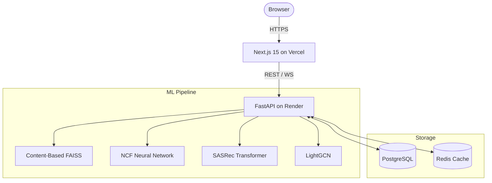

<div align="center">
  
  
  # NeuralFlix
  **The Premium Hybrid ML Recommendation & Cinematic Discovery Platform**

  [](https://fastapi.tiangolo.com/)
  [](https://nextjs.org/)
  [](https://tailwindcss.com/)
  [](https://pytorch.org/)
  [](https://www.postgresql.org/)
  [](https://neural-flix.vercel.app/)
  [](https://neuralflix.onrender.com)
</div>

<br />

> **NeuralFlix** is a state-of-the-art cinematic discovery engine that bridges regional global cinema with mainstream Hollywood blockbusters. It combines a stunning **glassmorphism** visual interface with a high-performance **PyTorch Hybrid Recommendation Engine** delivering hyper-personalized movie feeds in real-time.

---

## Live Demo & Deployment

| Platform | Link | Status |
| :--- | :--- | :--- |
| **Frontend UI** | [https://neural-flix.vercel.app/](https://neural-flix.vercel.app/) | Live (Vercel) |
| **Backend API** | [https://neuralflix.onrender.com/health](https://neuralflix.onrender.com/health) | Live (Render) |

> **Note:** The deep learning models (NCF & SASRec) are optimized for 512MB RAM free-tier cloud infrastructure, using a curated 10,000 movie catalog for rapid inference.

---

## Features

### User Interface (Glassmorphism Design)
- **3D WebGL Canvas**: Dynamic ambient particles, 3D card tilting, interactive recommendation orbs with Three.js
- **Taste DNA**: Canvas radar chart visualizing your genre preferences
- **Neural Match Score**: Animated circular progress indicator for recommendation confidence
- **Mood Discovery**: Real-time sliders mapping emotions to semantic vectors
- **Search with Autocomplete**: Debounced search with recent searches stored in localStorage

### ML Engine
- **Neural Collaborative Filtering (NCF)**: Dual-stream PyTorch network (GMF + MLP)
- **Sequential Transformers (SASRec)**: Self-attention sequence modeling for session-based recs
- **LightGCN**: Graph neural network with 3-layer message passing
- **Content-Based Filtering**: FAISS-powered similarity search with sentence-transformers
- **Cold Start**: Tiered onboarding (cold_start/warming/active) with scored candidates
- **Exploration Bandit**: Thompson sampling + epsilon-greedy for explore/exploit balance
- **Sentiment Reranker**: BERT-based re-scoring of recommendations

## Architecture



## API Reference

| Endpoint | Method | Description |
| :--- | :---: | :--- |
| `/api/v1/auth/register` | POST | Register a new user |
| `/api/v1/movies` | GET | Paginated catalog with filtering |
| `/api/v1/recommendations/personalized` | GET | Hybrid ML recommendation feed |
| `/api/v1/search/mood` | GET | Emotional slider to semantic vectors |
| `/api/v1/events/watch` | POST | Log watch events in real-time |
| `/api/v1/events/rate` | POST | Log rating events |
| `/ws/recommendations/{id}` | WS | Real-time recs via WebSocket |
| `/v1/metrics/health` | GET | System health check |

---

## Local Installation & Setup

### Prerequisites
- Node.js v20+
- Python 3.11+
- PostgreSQL (local or cloud) - optional, demo mode uses SQLite

### Backend Setup
```bash
cd backend
python -m venv venv
# Windows: .\venv\Scripts\activate
# Linux/Mac: source venv/bin/activate
pip install -r requirements.txt
uvicorn main:app --host 127.0.0.1 --port 8000 --reload
```

### Frontend Setup
```bash
cd frontend-next
npm install
npm run dev
```

Open [http://localhost:3000](http://localhost:3000) to use NeuralFlix locally.

> **Demo Mode:** Set `NEURALFLIX_DEMO_MODE=true` to skip PostgreSQL/Redis requirements. The app uses SQLite with in-memory query translation.

---

## Observability & Diagnostics
- Structlog structured logging with request IDs
- Prometheus metrics endpoint for monitoring
- Prometheus + Grafana in Docker Compose for observability

## License & Attributions
- **License**: MIT License
- **Metadata**: TMDB, OMDB, Trakt.tv, Watchmode
- **Dataset**: MovieLens 25M for model training
