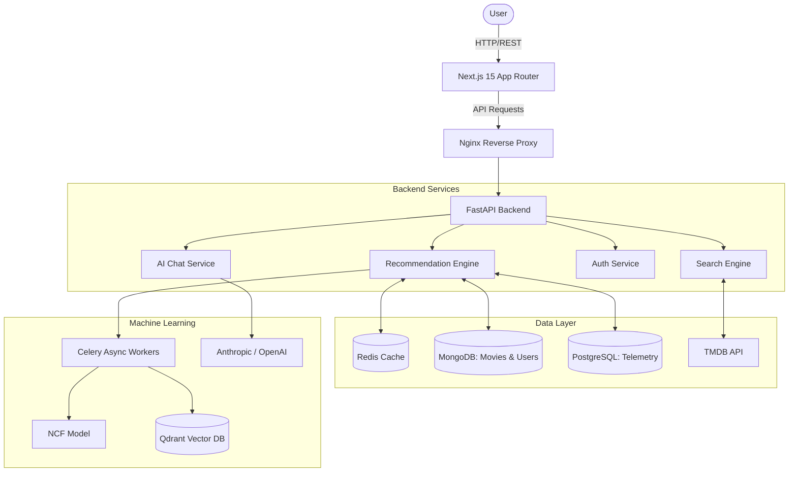

# NeuralFlix 🎬

NeuralFlix is a premium, AI-powered global cinema discovery platform. It leverages a robust FastApi backend with Neural Collaborative Filtering (NCF), vector similarity search, and a high-fidelity Next.js 15 frontend featuring a adaptive Light/Dark "Liquid Glass" theme.

## 🌟 Features
- **Global Cinema Engine**: A unique data ingestion pipeline balanced across Hollywood, Bollywood, Korean, French, and 50+ other cinema regions.
- **AI Chat Assistant**: Conversational movie discovery powered by Large Language Models (Claude/GPT).
- **Mood-Based Discovery**: Vector embeddings map emotional tones to specific movie recommendations.
- **Hybrid Recommendation Engine**: Combines collaborative filtering (user interactions) with content-based semantic matching.
- **Premium UI**: "Liquid Glass" aesthetics, animated Aurora mesh gradients, and Bento Box layouts for maximum visual impact.

## 🏗 Architecture



## 🚀 Tech Stack

### Frontend
- **Framework**: Next.js 15 (App Router)
- **Styling**: Tailwind CSS v4, Framer Motion
- **Design System**: Custom CSS Design Tokens, "Liquid Glass" & "Aurora" effects
- **Components**: Lucide React, `cmdk` (Command Palette), `react-simple-maps` (Cinema Map)

### Backend
- **Framework**: FastAPI (Python 3.11)
- **Data Science / ML**: Scikit-Learn, implicit, sentence-transformers, pandas
- **Auth**: JWT, passlib
- **Task Queue**: Celery + Redis

### Databases
- **MongoDB**: Primary document store for global movie metadata and user profiles.
- **PostgreSQL**: Relational store for user interaction logs and ML telemetry.
- **Qdrant**: Vector database for semantic search and mood-based discovery.

## 🛠 Installation & Setup

### Prerequisites
- Docker & Docker Compose
- Node.js 20+ (for local frontend development)
- Python 3.11+ (for local backend development)

### 1. Environment Configuration
Copy the `.env.example` files to `.env` in both the root and `backend` directories. Add your API keys (TMDB, LLM Provider, etc.).

### 2. Run via Docker Compose (Recommended)
This will start the entire stack (Nginx, FastAPI, Next.js, Redis, Postgres, MongoDB, Prometheus, Grafana).
```bash
docker-compose up -d --build
```

Access the application at `http://localhost`.

### 3. Local Development

**Backend:**
```bash
cd backend
python -m venv venv
source venv/bin/activate  # or venv\Scripts\activate on Windows
pip install -r requirements.txt
uvicorn main:app --reload
```

**Frontend:**
```bash
cd frontend-next
npm install
npm run dev
```

## 🧠 Recommendation Engine Details
The `backend/nn.md` file contains detailed architecture notes for the NeuralFlix Hybrid Recommendation pipeline, including GMF, MLP, and NeuMF layers, as well as the regional balancing logic.

## 📄 License
MIT License. Created for the future of cinematic discovery.
