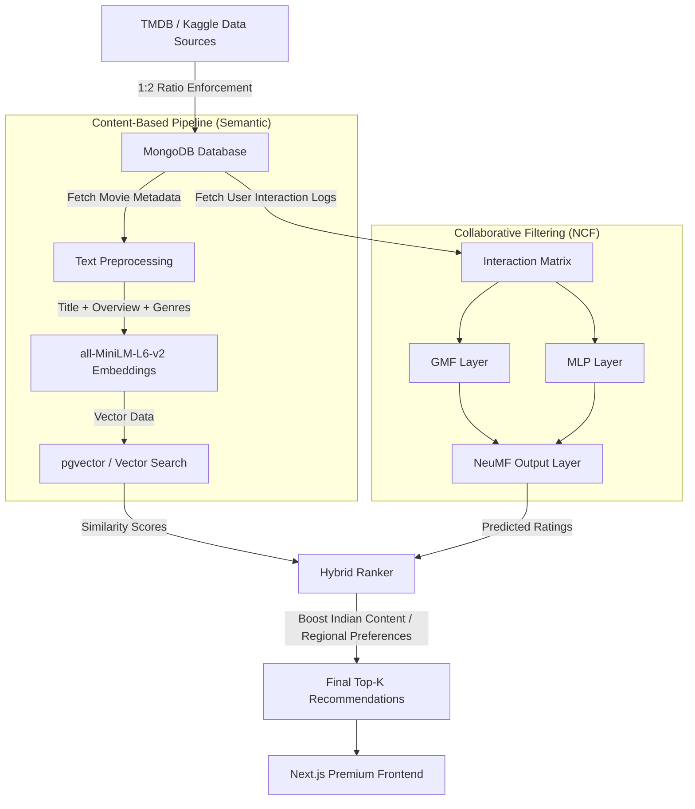

# NeuralFlix: Hybrid Recommendation Architecture

The NeuralFlix recommendation engine utilizes a robust **Hybrid Recommendation System** to provide hyper-personalized movie suggestions. It combines **Neural Collaborative Filtering (NCF)** with **Content-Based Filtering (Semantic Embeddings)**, strictly adhering to our specialized regional data ingestion ratio (1/3 Indian Cinema, 2/3 Hollywood).

## 1. High-Level Architecture Diagram

## 2. Component Breakdown

### A. Data Ingestion (Regional Balancing)
We employ a specialized ingestion script `ingest_ratio_movies.py` that strictly filters incoming Kaggle data to maintain a **33% Indian Movies / 67% Hollywood Movies** ratio. This ensures our models do not suffer from severe geographical bias and provide robust localized suggestions.

### B. Semantic Embeddings (Content-Based)
Using `sentence-transformers`, we generate 384-dimensional dense vectors representing the semantics of each movie's overview, title, and genres.
- Allows for "Cold Start" recommendations (when a movie has no interactions).
- Supercharges the `MoodPicker` UI by finding emotionally similar movies.

### C. Neural Collaborative Filtering (NCF)
The NCF model learns non-linear latent features of users and movies.
- **GMF (Generalized Matrix Factorization)**: Captures linear interactions.
- **MLP (Multi-Layer Perceptron)**: Captures complex, non-linear interactions.
- **NeuMF**: Concatenates GMF and MLP outputs for the final prediction score.

### D. The Hybrid Ranker
The Ranker combines scores from the vector search and the NCF model.
$$ FinalScore = (\alpha * NCF\_Score) + ((1 - \alpha) * Semantic\_Similarity) $$
The ranker incorporates a `regional_boost` parameter to prioritize Indian cinema (Bollywood, Tollywood) if the user's IP or preferences lean heavily toward regional content.
